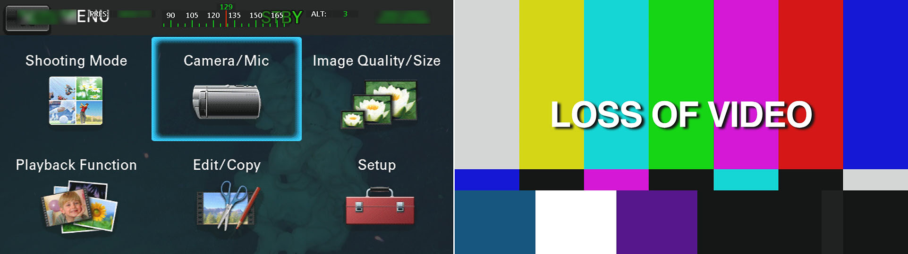

# vtf - Extract frames from ROV videos

vtf (video to frames) is designed to extract equally spaced frames from deep-sea benthic survey videos.
It mainly calculates the optical flow using opencv to ascertain if the camera has moved enough to grab a frame.

The script uses two methods to calculate the flow. First, it tries to generate points with the Shi-Tomasi algorithm.
If enough points are generated, they are tracked with the Lucas-Kanade method, until they cannot be detected anymore. Else, it uses the Farneback method to calculate the flow in a smaller area in the center of the video.
Lucas-Kanade is more accurate and less computational expansive, but  it only works in certain types of substrate, where there is enough features (mainly corners) to track.
Hence, the script uses Farneback when the substrate is very smooth or when the camera is further away.
Though these are not "state-of-the-art" optical flow methods, they are easily available in opencv.

In addition, the script also detects when an unwanted overlay is in the image (e.g. setting camera parameters,
out of signal) or when the camera is out of focus, and ignore these frames as well. You can set
the size of the output frames, and the script will select the area with highest brightness to grab the frame
(see the red rectangle below).

<br>
<i>Output video showing points being traked, output window (in red) 
and frames generated (note the keyframe counter in green).</i>
<br><br>
<br>
<i>Examples of overlays that can be ignored.</i>


### Usage
**Make sure you read and edit `vtf_config.py` before running**

- for a single video file
```
python vtf.py path/to/video start end [real_time [output_folder]]
    start - time in the video to start processing, in the format HH:MM:SS
            can be 00:00:00 to start in the begging of the file
    end - time in the video to stop processing, in the format HH:MM:SS
    real_time - local time which corresponds to start, in the format HH:MM:SS
                can be 0, where it will be get from the timestamp of the video (default)
    output_folder - path/to/output where to store all the frames
                    default is to store in the folder "frames", same path as the script
```
<br>

- for a csv file (see example in docs/csv_example.csv)
```
python vtf.py path/to/file.csv [output_folder]
    output_folder - path/to/output where to store all the frames
                    default is to store in the folder "frames", same path as the script
                    
```
\- if a column start_time is provided in the csv, it will be used to get the real_time
    that corresponds with the start_file_time, else it will be get from the timestamp of the video

### Output
For each video, frames are saved in a folder with the same name as the video.
The script also makes two csv files. A log.csv (within folder with frames), containing events for each video, such as timestamp of each frame grabbed, when overlay and blurriness where detected, method used for optical flow and elapsed time since the last event. The output.csv contains the local time for each saved frame, thus can be merged with track data (provided it has timestamp) and plotted in a GIS software or used in other analyses.

### Requirements
- Python3
- numpy, scipy, pandas, opencv and pyqtgraph
- FFmpeg